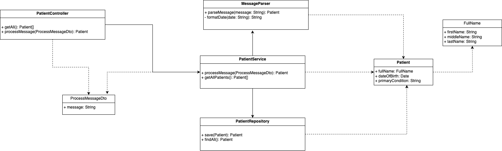

<p>
  <h1 align="center">Patient Message Processing Service</h1>
  <p align="center">
   This application processes structured plain-text messages containing patient information. It extracts relevant data, validates it, and stores it in a repository.
  </p>
</p>

<br>

## Table of Contents

- [Overview](#overview)
- [Installation](#installation)
- [Running the application](#running-the-app)
- [Testing](#test)
- [Objectives](#objectives)
- [Project Structure](#project-structure)
- [Separation of Concerns](#seperation-of-concerns)
- [Common Utilities](#utilities)
- [Modularity and Maintainability](#modularity-and-maintainability)
- [Error Handling and Logging](#error-handling-and-logging)
- [Scalability and Future Extensions](#scalability-and-future-extensions)
- [Project Summary](#summary)


## Overview
In building a full application around the core functionality of processing structured plain-text messages containing patient information, we need to ensure a clear separation of concerns, modularity, maintainability, robust error handling, and scalability. NestJS, a progressive Node.js framework, provides a robust foundation for developing such an application due to its use of TypeScript, strong modular architecture, and dependency injection.

## Installation

To set up the Patient Message Processing Service with Nest.js, follow these steps:

1. **Clone the repository:** `git clone https://github.com/thebolarin/patient.git`

2. **Install dependencies:** `cd patient && npm install`

3. **Copy environment variables** `cp .env.example .env`

   | Variable                          | Description                                              | Required |
   | :-------------------------------- | :------------------------------------------------------- | :------- |
   | PORT                              | Server port                                              | ✅ Yes   |


  ## Running the app

  ```bash
  # development
  $ npm run start

  # watch mode
  $ npm run start:dev

  # production mode
  $ npm run start:prod
  ```

## Testing

```bash
# unit tests
$ npm run test

# e2e tests
$ npm run test:e2e
```

## Objectives

- Accept a message that can be in plain text or JSON format
- Use extraction logic to retrieve the required fields: Patient Name, Date of Birth, and Admitting Diagnosis
- Validate the presence and format of these fields.
- Handle errors gracefully if fields are missing or improperly formatted.
- Simulate storing the extracted data without requiring a real database.
- Provide the extracted data if everything is correct.
- Return a meaningful error response if there are issues with the input.


## Project Stucture



## Separation of Concerns

1. **Presentation Layer (Controllers)**
    - Controllers: Responsible for handling incoming requests, validating input, invoking corresponding services, and returning responses.
        
             patient.controller.ts handles API endpoints related to patient data.

2. **Business Logic Layer (Services)**
    - Services: Contain the core business logic and interact with repositories to fetch or store data
        
             patient.service.ts implements the logic for processing the messages by extracting patient data from the `MessageParser` utility class, and interacting with the repository.

3. **Data Access Layer (Repositories)**
     - Repositories: Abstract the data persistence layer, making it easy to swap out databases or data sources.
        
            The patient.repository.ts file handles data storage operations (which is mocked for this task). If we integrate a NoSQL database, we can place the patient schema in a schema folder within the patient module. The schema would be defined in a file named patient.schema.ts, and the patient.repository.ts would be updated to interact with the patientSchema.
    1. **Choose an ORM**: TypeORM or Mongoose is recommended for its ease of use with TypeScript.
    2. **Define Entities**: Create models representing the data structure (e.g., `Patient` entity).
    3. **Repository Pattern**: Use repositories for all database operations.

## Common Utilities
   - Utilities: Helper functions and utilities shared across the application, such as the message parsing logic.
    
    message-parser.util.ts contains functions to parse and validate message contents.This file contains the logic for parsing the incoming messages and ensure that the parsing correctly handles the format specified in the task and performs necessary validations.


## Modularity and Maintainability
By dividing the application into clearly defined modules, each responsible for a specific domain (e.g., patient), we ensure that the codebase is modular and easy to maintain. Each module encapsulates its own entities, services, controllers, and data access logic.

- **Reusable Components**: Common utilities, DTOs, and interfaces are placed in shared directories to promote reusability.
- **Testing**: Each module has its own test suite to ensure isolated and comprehensive testing.

## Error Handling and Logging
1. **Filters:** Custom exception filters, such as `http-exception.filter.ts`, catch and format exceptions consistently across the application.

2. **Interceptors:** Logging interceptors, like `logging.interceptor.ts`, log all incoming requests and outgoing responses, aiding in debugging and monitoring.


## Scalability and Future Extensions

1. Scalability:

- **Modular Architecture:**
        The modular architecture of NestJS makes it easy to add new features or domains without affecting existing functionality. New modules can be added as needed, and existing ones can be expanded independently.

2. Future Extensions:

- Add new modules without affecting existing functionality
- Keep the codebase well-documented to make it easier for new developers to contribute.
- Regularly refactor and review the code to accommodate new requirements.
- Separate environment configurations (development.env, production.env) to ensure that the application can be easily configured for different environments, supporting scalability and maintainability.
- Logs can be stored and analyzed for monitoring and debugging.
- Logging interceptors, like `logging.interceptor.ts`, log all incoming requests and outgoing responses, aiding in debugging and monitoring.
- Containerize the application using Docker and deploy with orchestration tools like Kubernetes.

- Use indexing, pagination, caching, and optimized queries to handle increased load.


## Summary
- **PatientRepository**: Manages an in-memory array for storing patient data.
- **PatientService**: Processes the message and saves the parsed data using PatientRepository.
- **PatientController**: Provides endpoints for processing messages and retrieving all stored patient data.
- **MessageParser**: Contains logic for parsing and validating the message.


This approach ensures a clean separation of concerns, making the application modular and maintainable. The in-memory repository can be easily replaced with a database implementation in the future without affecting other parts of the application.
